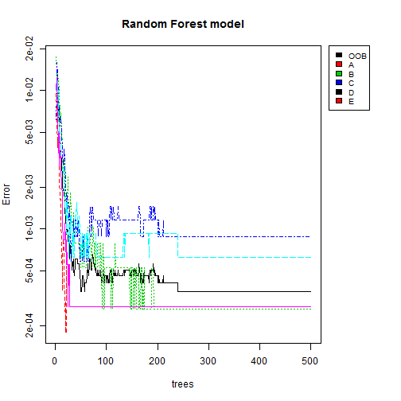
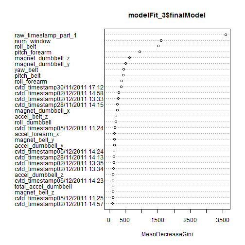

Practical Machine Learning: Personal Activity Prediction Assignment
========================================================

In this assignment we use data from accelerometers on the belt, forearm, arm, and dumbell of 6 participants:

* Training data: https://d396qusza40orc.cloudfront.net/predmachlearn/pml-training.csv
* Testing data: https://d396qusza40orc.cloudfront.net/predmachlearn/pml-testing.csv

* More information: http://groupware.les.inf.puc-rio.br/har

The goal of this machine learning assignment is to predict the manner in which they did the exercise. This is the "classe" variable in the training set.

## 1. Load and clean the data
First we download both training and testing CSV files from the above links. After that, we load both files into R-Studio using "read.csv" function:


```r
trainingFile <- read.csv("pml-training.csv")
testingFile <- read.csv("pml-testing.csv")
```


Inmediately we remove the row number (1st column in the dataset), since it has a strong correlation with the classe variable we want to predict and it causes a bad behavior of the prediction model.


```r
trainingFile <- trainingFile[, 2:ncol(trainingFile)]
testingFile <- testingFile[, 2:ncol(testingFile)]
```


We ensure that both training and testing datasets are similar. They seem to have all same names but the last one. It doesn't matter, cause it's not one of the predictors:


```r
table(colnames(trainingFile) == colnames(testingFile))
```

```
## 
## FALSE  TRUE 
##     1   158
```

```r
which(colnames(trainingFile) != colnames(testingFile))
```

```
## [1] 159
```


Then, we detect those variables which have missing values in the training dataset. 


```r
table(apply(is.na(trainingFile), 2, sum))
```

```
## 
##     0 19216 
##    92    67
```


We see that most of the variables in training dataset which have missing values, they also have almost all the rows with "NA". So we will remove the variables having at least one "NA". This is an ad-hoc decision, but if dataset had only few "NA"-s in some variables, another criterion would have to be performed:


```r
badTrainVariables <- apply(is.na(trainingFile), 2, sum) > 0

trainingData <- trainingFile[, !badTrainVariables]
testingData <- testingFile[, !badTrainVariables]
```


We have the same issue with testing dataset. Some variables have almost all rows as missing values.


```r
table(apply(is.na(testingData), 2, sum))
```

```
## 
##  0 20 
## 59 33
```


So we remove those variables both from training and testing datasets.


```r
badTestVariables <- apply(is.na(testingData), 2, sum) > 0

trainingData <- trainingData[, !badTestVariables]
testingData <- testingData[, !badTestVariables]
```


## 2. K-fold cross-validation and Model comparison

```r
library(caret)
library(randomForest)
```


We perform cross-validation for an estimate of error taking k=10 folds.


```r
set.seed(1208)
kFolds <- sample(1:10, nrow(trainingData), replace = TRUE)
table(kFolds)
```

```
## kFolds
##    1    2    3    4    5    6    7    8    9   10 
## 1957 1957 2029 1940 1957 2029 1942 1932 1921 1958
```


Additionally, we compare 3 different train methods:

1. RPART
2. LDA
3. Random Forest

Random forest has the best accuracy on its predictions. It's explained in the next lines.

### 2.1 RPART method

First, we build the model and estimate the error rate using previously created k=10 cross-validation.


```r
# RPART k=10 fold cross-validation
set.seed(1208)
cvError_RPART <- rep(NA, 10)
for (i in 1:10) {
    tempModelFit <- train(classe ~ ., data = trainingData[kFolds != i, ], preProcess = c("center", 
        "scale"), method = "rpart")
    tempPredictions <- predict(tempModelFit, newdata = trainingData[kFolds == 
        i, ])
    cvError_RPART[i] <- 1 - sum(diag(table(tempPredictions, trainingData$classe[kFolds == 
        i])))/length(tempPredictions)
}
```


This is the k=10 folds Cross-Validation error estimate (47%):


```r
cvError_RPART
```

```
##  [1] 0.4911 0.5105 0.4273 0.4474 0.5294 0.3662 0.4449 0.5611 0.4310 0.5066
```

```r
mean(cvError_RPART)
```

```
## [1] 0.4715
```


Now we build a model using all the training data.


```r
set.seed(1208)
trainControl <- trainControl(method = "cv", number = 10)
modelFit_1 <- train(classe ~ ., data = trainingData, trControl = trainControl, 
    preProcess = c("center", "scale"), method = "rpart")
```


The accuracy of RPART model is 53%, more or less according to calculated values with Cross-Validation.


```r
modelFit_1
```

```
## CART 
## 
## 19622 samples
##    58 predictors
##     5 classes: 'A', 'B', 'C', 'D', 'E' 
## 
## Pre-processing: centered, scaled 
## Resampling: Cross-Validated (10 fold) 
## 
## Summary of sample sizes: 17660, 17661, 17660, 17661, 17658, 17659, ... 
## 
## Resampling results across tuning parameters:
## 
##   cp    Accuracy  Kappa  Accuracy SD  Kappa SD
##   0.04  0.5       0.4    0.03         0.04    
##   0.05  0.4       0.3    0.07         0.1     
##   0.1   0.3       0.07   0.04         0.06    
## 
## Accuracy was used to select the optimal model using  the largest value.
## The final value used for the model was cp = 0.04.
```


### 2.2 LDA method

First, we build the model and estimate the error rate using previously created k=10 cross-validation.


```r
# LDA k=10 fold cross-validation
set.seed(1208)
cvError_LDA <- rep(NA, 10)
for (i in 1:10) {
    tempModelFit <- train(classe ~ ., data = trainingData[kFolds != i, ], preProcess = c("center", 
        "scale"), method = "lda", allowParallel = TRUE)
    tempPredictions <- predict(tempModelFit, newdata = trainingData[kFolds == 
        i, ])
    cvError_LDA[i] <- 1 - sum(diag(table(tempPredictions, trainingData$classe[kFolds == 
        i])))/length(tempPredictions)
}
```


This is the k=10 folds Cross-Validation error estimate (14%):


```r
cvError_LDA
```

```
##  [1] 0.1405 0.1497 0.1483 0.1387 0.1543 0.1508 0.1370 0.1625 0.1270 0.1384
```

```r
mean(cvError_LDA)
```

```
## [1] 0.1447
```


Now we build a model using all the training data.


```r
set.seed(1208)
trainControl <- trainControl(method = "cv", number = 10)
modelFit_2 <- train(classe ~ ., data = trainingData, trControl = trainControl, 
    preProcess = c("center", "scale"), method = "lda", allowParallel = TRUE)
```


The accuracy of LDA model is 90%, optimistic if we compare to Cross-Validation error estimate(100 - 14.47 = 85.53%).


```r
modelFit_2
```

```
## Linear Discriminant Analysis 
## 
## 19622 samples
##    58 predictors
##     5 classes: 'A', 'B', 'C', 'D', 'E' 
## 
## Pre-processing: centered, scaled 
## Resampling: Cross-Validated (10 fold) 
## 
## Summary of sample sizes: 17660, 17661, 17660, 17661, 17658, 17659, ... 
## 
## Resampling results
## 
##   Accuracy  Kappa  Accuracy SD  Kappa SD
##   0.9       0.8    0.01         0.01    
## 
## 
```


### 2.3 Random Forest method

First, we build the model and estimate the error rate using previously created k=10 cross-validation.


```r
# Random Forest k=10 fold cross-validation
set.seed(1208)
cvError_RF <- rep(NA, 10)
for (i in 1:10) {
    tempModelFit <- train(classe ~ ., data = trainingData[kFolds != i, ], preProcess = c("center", 
        "scale"), method = "rf", allowParallel = TRUE)
    tempPredictions <- predict(tempModelFit, newdata = trainingData[kFolds == 
        i, ])
    cvError_RF[i] <- 1 - sum(diag(table(tempPredictions, trainingData$classe[kFolds == 
        i])))/length(tempPredictions)
}
```


This is the k=10 folds Cross-Validation error estimate (less than 1%):


```r
cvError_RF
mean(cvError_RF)
```


Due to computational costs and knitr() cache issues, I have omitted last two r-chunks 'eval = FALSE' (those relative to "Random Forest" k=10 folds Cross-Validation). Anyway, I give the neccesary code to perform the Cross-Validation error estimate so anyone can reproduce the experiment.

Now we build a model using all the training data.


```r
set.seed(1208)
trainControl <- trainControl(method = "cv", number = 10)
modelFit_3 <- train(classe ~ ., data = trainingData, trControl = trainControl, 
    preProcess = c("center", "scale"), method = "rf", allowParallel = TRUE)
```


The accuracy of Random Forest model is 100%.


```r
modelFit_3
```

```
## Random Forest 
## 
## 19622 samples
##    58 predictors
##     5 classes: 'A', 'B', 'C', 'D', 'E' 
## 
## Pre-processing: centered, scaled 
## Resampling: Cross-Validated (10 fold) 
## 
## Summary of sample sizes: 17660, 17661, 17660, 17661, 17658, 17659, ... 
## 
## Resampling results across tuning parameters:
## 
##   mtry  Accuracy  Kappa  Accuracy SD  Kappa SD
##   2     1         1      0.002        0.003   
##   40    1         1      5e-04        6e-04   
##   80    1         1      5e-04        7e-04   
## 
## Accuracy was used to select the optimal model using  the largest value.
## The final value used for the model was mtry = 41.
```


## 3. Selecting the best model and performing prediction on test dataset

Finally we select "Random Forest" method, cause it generates the model with the best accuracy (100%) at prediction:


```r
modelFit_3$finalModel
```

```
## 
## Call:
##  randomForest(x = x, y = y, mtry = param$mtry, allowParallel = TRUE) 
##                Type of random forest: classification
##                      Number of trees: 500
## No. of variables tried at each split: 41
## 
##         OOB estimate of  error rate: 0.04%
## Confusion matrix:
##      A    B    C    D    E class.error
## A 5580    0    0    0    0   0.0000000
## B    1 3796    0    0    0   0.0002634
## C    0    3 3419    0    0   0.0008767
## D    0    0    1 3214    1   0.0006219
## E    0    0    0    1 3606   0.0002772
```


We add a plot of the Random Forest model, in order to see the overall error of the model:


```r
layout(matrix(c(1, 2), nrow = 1), width = c(4, 1))
par(mar = c(5, 4, 4, 0))
plot(modelFit_3$finalModel, log = "y", main = "Random Forest model")
par(mar = c(5, 0, 4, 2))
plot(c(0, 1), type = "n", axes = F, xlab = "", ylab = "")
legend("top", colnames(modelFit_3$finalModel$err.rate), col = 1:4, cex = 0.8, 
    fill = 1:4)
```

 


Next we present a DotChart which aims to explain the importance of variables as measured by the Random Forest model:


```r
varImpPlot(modelFit_3$finalModel)
```

 


Thus, to conclude our project, we perform the prediction using the test dataset:


```r
predictions <- predict(modelFit_3, newdata = testingData)
predictions
```

```
##  [1] B A B A A E D B A A B C B A E E A B B B
## Levels: A B C D E
```

